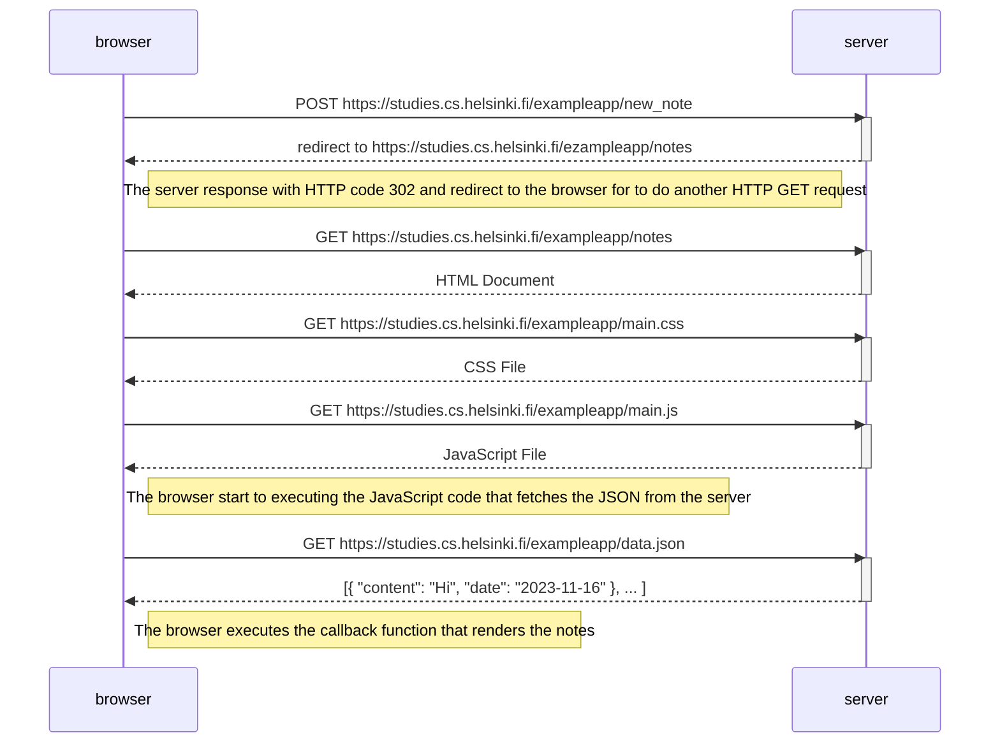

## Diagram

```mermaid
sequenceDiagram
  participant browser
  participant server

  browser->>server: POST https://studies.cs.helsinki.fi/exampleapp/new_note
  activate server
  server-->>browser: redirect to https://studies.cs.helsinki.fi/ezampleapp/notes
  deactivate server

  Note right of browser: The server response with HTTP code 302 and redirect to the browser for to do another HTTP GET request

  browser->>server: GET https://studies.cs.helsinki.fi/exampleapp/notes
  activate server
  server-->>browser: HTML Document
  deactivate server

  browser->>server: GET https://studies.cs.helsinki.fi/exampleapp/main.css
  activate server
  server-->>browser: CSS File
  deactivate server

  browser->>server: GET https://studies.cs.helsinki.fi/exampleapp/main.js
  activate server
  server-->>browser :JavaScript File
  deactivate server

  Note right of browser: The browser start to executing the JavaScript code that fetches the JSON from the server

  browser->>server: GET https://studies.cs.helsinki.fi/exampleapp/data.json
  activate server
  server-->>browser: [{ "content": "Hi", "date": "2023-11-16" }, ... ]
  deactivate server

  Note right of browser: The browser executes the callback function that renders the notes
```