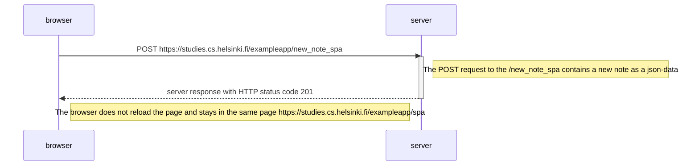

## Diagram

```mermaid
sequenceDiagram
  participant browser
  participant server

  browser->>server: POST https://studies.cs.helsinki.fi/exampleapp/new_note_spa
  activate server
  Note right of server: The POST request to the /new_note_spa contains a new note as a json-data

  server-->>browser: server response with HTTP status code 201
  deactivate server

  Note right of browser: The browser does not reload the page and stays in the same page https://studies.cs.helsinki.fi/exampleapp/spa
```