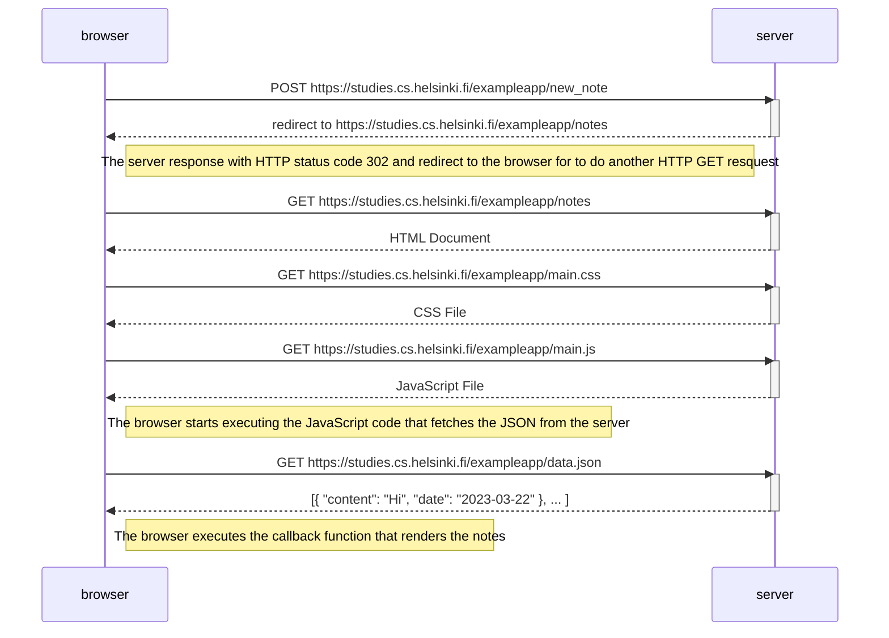

## Diagram

```mermaid
sequenceDiagram
    participant browser
    participant server
 
    browser->>server: POST https://studies.cs.helsinki.fi/exampleapp/new_note
    activate server
    server-->>browser: redirect to https://studies.cs.helsinki.fi/exampleapp/notes
    deactivate server
    
    Note right of browser: The server response with HTTP status code 302 and redirect to the browser for to do another HTTP GET resquest
    
    browser->>server: GET https://studies.cs.helsinki.fi/exampleapp/notes
    activate server
    server-->>browser: HTML Document
    deactivate server
    
    browser->>server: GET https://studies.cs.helsinki.fi/exampleapp/main.css
    activate server
    server-->>browser: CSS File
    deactivate server

    browser->>server: GET https://studies.cs.helsinki.fi/exampleapp/main.js
    activate server
    server-->>browser: JavaScript File
    deactivate server

    Note right of browser: The browser starts executing the JavaScript code that fetches the JSON from the server

    browser->>server: GET https://studies.cs.helsinki.fi/exampleapp/data.json
    activate server
    server-->>browser: [{ "content": "Hi", "date": "2023-03-22" }, ... ]
    deactivate server

    Note right of browser: The browser executes the callback function that renders the notes
```